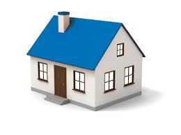
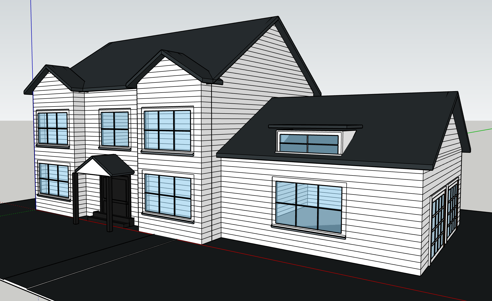
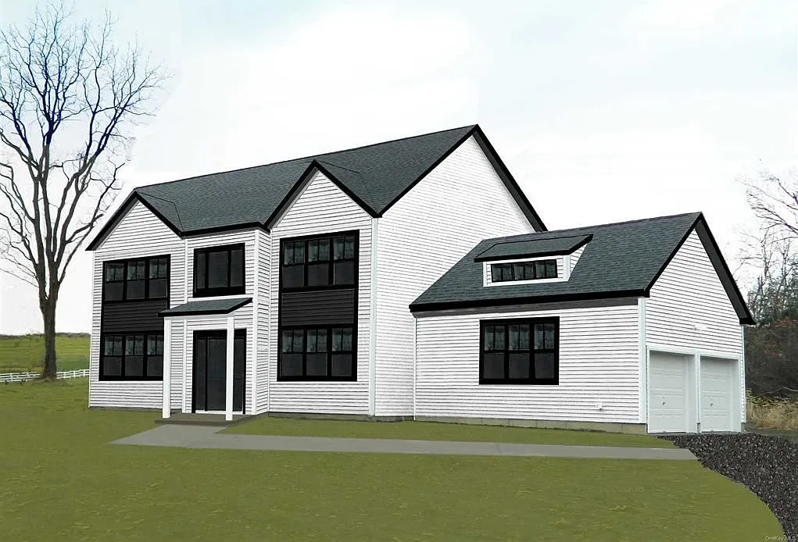
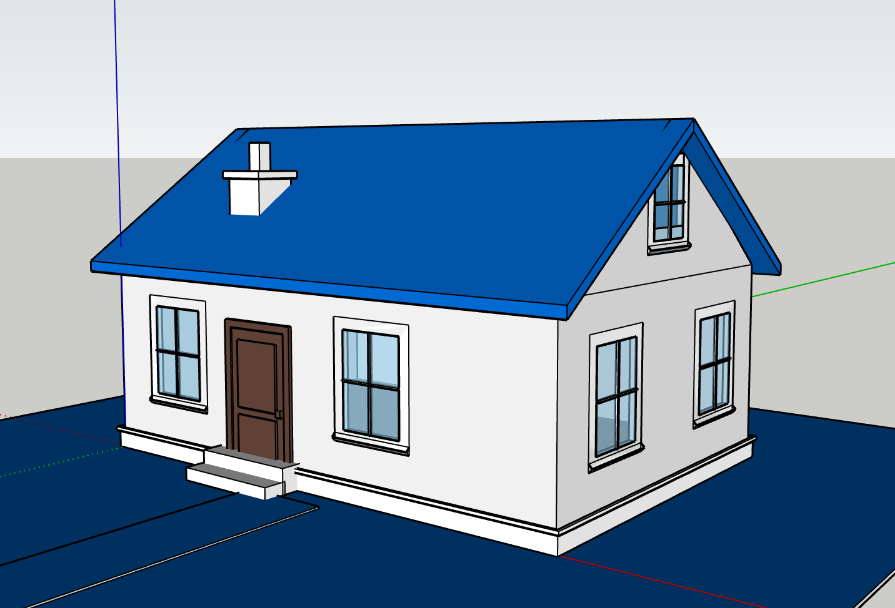

# Auto-SketchUp-Builder / AI 建筑智能生成器


*Scroll down for English version.*

## 🇨🇳 中文说明 (Chinese)

这是一个由大模型（GPT-4o / Gemini）视觉能力驱动的 2D 转 3D 建筑生成智能体。你只需要提供一张包含建筑的平面照片，AI 就能像高精度雷达一样扫描建筑的每一面墙、每一扇窗户、门廊、老虎窗和侧翼，并通过 MCP (Model Context Protocol) 控制 SketchUp 自动构建出带有材质的 3D 参数化模型。

### ✨ 核心特性
- **极限视觉解析**：零遗漏原则，精确识别建筑的各个体块、交叉山墙、屋顶类型（双坡、四坡、单坡、平顶）以及门窗细节。
- **SketchUp 无缝集成**：通过自定义 Ruby 插件 (`su_mcp.rbz`) 在 SketchUp 中建立 MCP Server，实现 Python 与 SketchUp 的实时交互。
- **参数化构建算法**：告别粗糙的体素模型，使用真实的建筑逻辑生成墙体、屋顶、柱子和屋檐。

### 🖼️ 效果展示 (Examples)

**测试组一**
| 原图 (Input) | 生成的 3D 模型 (Output) |
| :---: | :---: |
|  |  |

**测试组二**
| 原图 (Input) | 生成的 3D 模型 (Output) |
| :---: | :---: |
|  |  |

### 🚀 使用指南

#### 1. 安装 SketchUp 插件
在本项目根目录下找到 `su_mcp.rbz` 文件。
打开 SketchUp -> 窗口 (Window) -> 扩展程序管理器 (Extension Manager) -> 安装扩展程序 (Install Extension)，选择 `su_mcp.rbz` 并安装。
安装完成后，在 SketchUp 菜单栏找到 **"Extensions" -> "Start MCP Server"** 并点击运行（默认端口 9876）。

#### 2. 运行后端服务
克隆本仓库后，配置环境变量并启动后端：
```bash
# 复制配置文件并填写你的 API Key
cp .env.example .env
# 填入你的 OPENAI_API_KEY (默认使用 gpt-4o 作为主模型)

# 安装依赖
pip install -r requirements.txt

# 启动服务
python main.py
```

#### 3. 测试与体验
服务启动后，你有两种方式进行测试：
- **开发调试模式**：在浏览器打开 `http://localhost:8000/docs`，找到 `/api/chat/start` 接口，上传照片即可触发生成。
- **前端界面模式**：如果你有配合的 `frontend` 文件夹，直接在浏览器中双击打开 `index.html` 即可使用可视化界面进行生成测试。

---

## 🇬🇧 English (English)

An AI-powered architectural agent that translates 2D building images into 3D parametric SketchUp models using the vision capabilities of GPT-4o / Gemini. By providing a single photo of a house, the AI meticulously scans for every wall, window, door, dormer, and side wing, and automates SketchUp via the Model Context Protocol (MCP) to build a fully textured 3D model.

### ✨ Key Features
- **Extreme Visual Parsing**: Zero-omission principle to accurately identify building blocks, cross-gables, roof types (gable, hip, shed, flat), and precise window/door placements.
- **Seamless SketchUp Integration**: Establishes an MCP Server in SketchUp using a custom Ruby plugin (`su_mcp.rbz`) for real-time Python-to-SketchUp interaction.
- **Parametric Generation Algorithm**: Constructs walls, roofs, columns, and eaves using real-world architectural logic.

### 🖼️ Examples

**Group 1**
| Input Image | Generated 3D Model |
| :---: | :---: |
|  |  |

**Group 2**
| Input Image | Generated 3D Model |
| :---: | :---: |
|  |  |

### 🚀 Usage Guide

#### 1. Install the SketchUp Plugin
Locate the `su_mcp.rbz` file in the root directory.
Open SketchUp -> Window -> Extension Manager -> Install Extension, and select `su_mcp.rbz`.
Once installed, go to **Extensions -> Start MCP Server** in SketchUp's top menu (defaults to port 9876).

#### 2. Run the Backend Service
Clone this repository, configure the environment, and start the backend:
```bash
# Copy the config file and fill in your API Key
cp .env.example .env
# Enter your OPENAI_API_KEY (defaults to gpt-4o as the heavy model)

# Install dependencies
pip install -r requirements.txt

# Start the service
python main.py
```

#### 3. Test the Application
Once the server is running, you can test it in two ways:
- **API Docs**: Open `http://localhost:8000/docs` in your browser, find the `/api/chat/start` endpoint, and upload an image to generate the model.
- **Frontend UI**: If you have the associated `frontend` folder, simply open `index.html` in your browser to use the visual interface.

---
## License
MIT License
